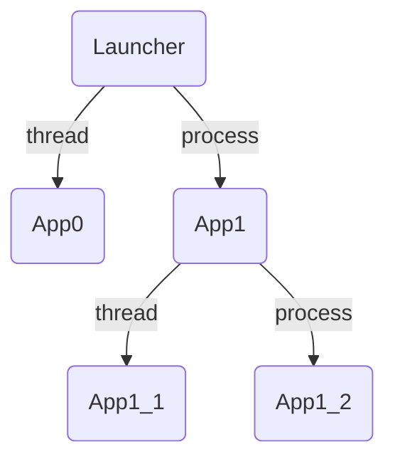

# Tutorial
A brief description for JarvisEngine

## Project Structure
Let's take a look inside the project created by `python -m JarvisEngine create -d MyProject` earlier in `Readme.ja.md` 
The project structure should look like this.
```
MyProject
├── app.py
└── config.json5
```
- app.py
```py
from JarvisEngine.apps import BaseApp

class App(BaseApp):

    def Start(self):
        self.logger.info("Started!")

    frame_rate = 10.0
    def Update(self, delta_time: float) -> None:
        self.logger.info(f"Updating in {delta_time:.2f} secs.")
```

- config.json5
```json5
{
    MyApp: {
        path: "app.App",
        thread: true,
        apps:{}
    }
}
```

## File explanation
In a template project, There are 2 files: application file and structure description file.  
These files are essential to run JarvisEngine. Let's explain one by one.

### Application  (`app.py`)
A file where an Application functions and process is written. (**python source code**)
An application use **threads** and **process** to run in parallel.  
An application work by `BaseApp`(Overridable Methods) inheritance.

- Start(self)  
Application's main operation.
A method is called when the Parallel process is started. 

    ```py
    class App(BaseApp):

        def Start(self):
            ...
    ```

- frame_rate   
A frame_rate to call the `Update` method. frame_rate value will determine how the `Update` method is called
    - Positive value
    `Update` call with frame_rate value
    - Zero   
    `Update` call once. This is because the loop is divergence.
    - Negative value
    Immediately execute the `Update` method. This is because the cycle will be negative, and the frame will be in the past. Hence, the wait time will always be zero.

    ```py
    class App(BaseApp):

        frame_rate = 1.0
        ...
    ```

- Update(self, delta_time)  
The function called by frame_rate value (in 1 second) 
The argument `delta_time` is the elapsed time since the previous frame.
Hence, `delta_time` will only be 0.0 (or close to 0.0) only at the beginning 

    ```py
    class App(BaseApp):

        def Update(self, delta_time):
            ...
    ```

In addition to the methods listed here, there are several other methods that can be overridden.
- Init(self)  
A function called at last in Application Constructor.

- RegisterProcessSharedValues(self, sync_manager)  
Please see section for more information [Sharing values between applications](#Sharing-values-between-applications).
- RegisterThreadSharedValues(self)  
Please see section for more information [Sharing values between applications](#Sharing-values-between-applications).
- Awake(self)  
A function called immediately after the start of a process or thread. Note that shared values between processes/threads cannot be used after this function is called.

- End(self)  
A function called at the end of the process/thread.

- Terminate(self)  
A function called just before the end of the process/thread. Note that this method will not be called if the child application is not terminated.


### Structure description file (`config.json5`)
This is a **json5 file** that describes the application startup structure. It is described by specifying the module path of the application. It also describes whether to start parallel processing in threads or processes. 
Running multiple application with the same format at the topmost field of this file or after `apps` is also possible. More information regarding startup will be written at  [Launch multiple applications](#Launch-multiple-applications)

- Example  
```json5
{
    App0: {
        path: "App0.app.App0",
        thread: true,
        // `apps` is not necessary.
    },
    App1: {
        path: "App1.app.App1",
        thread: false,
        apps: {
            App1_1: {
                path: "App1.App1_1.app.App1_1",
                thread: true,
                apps: {}
            },
            App1_2: {
                path: "App1.App1_2.app.App1_2",
                thread: false,
            }
        }
    }
}
```
- About `path`  
This is the module path to the application class to start. Write in a form **readable by python import**
- About `thread`  
In case `true`, The application will use thread (`threading` module) and begin parallel processing. In case `false`, The process(`multiprocessing` module) will use other intepreter instead.    
<br>

The main reason for using json5 because it can add comments with ease. JSON files with other names can also be read if explicitly specified at startup. Details are explained in section [JarvisEngine startup commands](#JarvisEngine-startup-commands).


## Launching multiple applications
[Structure description file (`config.json5`)](#Structure-description-file-(`config.json5`)) in example of application launch structure have the following tree structure.
The application on top is `Launcher` application. The application after that will be launch following the tree structure.



### Process and Thread
There is a clear difference between starting an application with process and with thread. In **process**, interpreter and memory are completely seperated. While thread is an execution inside process while sharing memory.
In the case of threads, memory is shared and resources can be handed over very easily and startup is fast, but there are performance limitations due to GIL.    
In the case of a process, the interpreter is completely separated, so performance is not limited by the GIL, but there are limitations on the resources that can be shared.

### Spawn and Fork
There are two typical ways to start a process: `spawn` and `fork`. (`fork` is available only on UNIX-like systems.) 
Please note that JarvisEngine is using `spawn` on default.  
In later at [Engine Settings](#Engine-Settings), We will explain how to change the `start_method` of JarvisEngine.
#### **Note**  
Note that start a Multi-process threads using `fork` are dangerous and may encounter unexpected bugs such as freezing! If you use are using `fork`, please design your application startup configuration carefully.
## Sharing values between applications.
Sharing values between applications is essential for parallel processing. However, this is also where we encounter most of the bugs.
JarvisEngine **explicitly** registers values to be shared among threads and processes and manages them as a single object.

### Basic Concepts
The basic when sharing a file is to refer to **File system**, and use the *paths* which are consistent with the python module system. 
Let's say your application is configured as follows. We will use this as an example.    

### FolderDict (with Lock)
All shared object is manage as single class named `FolderDict_withLock`[Please see FolderDict repository for a detailed specification of FolderDict](https://github.com/Geson-anko/folder_dict)  
You can register objects by *path*. Seperaotr in JarvisEngine is `.`. This cannot be changed.
- Example
```py
fd = FolderDict(sep=".")
fd["path.to.object"] = "instance"
> fd["path.to"]["object"]
--> "instance"
```
### Sharing paths and objects
Paths are in dot `.` delimited format, and there are two forms: **absolute paths**, where there is no dot at the beginning of the path string, and **relative paths**, where there are several dots at the beginning and the referencing is relative.  
Absolute paths can be used well in any application, but if there is a change in application startup configuration, the described path must be changed as well. Relative paths are based on the location of the application startup configuration file and can be easily import to other JarvisEngine projects (group of several applications as a **component**).

Note: Relative paths are referenced backward in the parent directory by **the number of dots at the beginning of the path string - 1**.

Note: Absolute paths are always prefixed at `Launcher`. This is because the top-level application in the startup configuration file is launched by `JarvisEngine.apps.Launcher`.


- Example  
    Suppose that `App1` is sharing value named `int_value` between processes.
    You can share by do the following.
    
    ```py
    import multiprocessing as mp
    class App1(BaseApp):
    
        def RegisterProcessSharedValues(self, sync_manager):
            super().RegisterProcessSharedValues(sync_manager) # must call.
            self.addProcessSharedValues("int_value",mp.Value("i"))
    ```

    By doing this, Inside of `FolderDict`, The value will be registered and manage as `Launcher.App1.int_value`. By referencing startup position, all of the application can access to `int_values`

    To access `int_value`, you use a method name `<BaseApp>.getProcessSharedValues(name)`. Of course, both absolute and relative paths can be accessed.
    And even if `App0` shares a value with the name `bool_value`, it can be accessed either absolutely or relatively.

    ```py
    ... # in App1 class.
        def Start(self):
            # Absolute 
            int_value = self.getProcessSharedValue("Launcher.App1.int_value")
            bool_value = self.getProcessSharedvalue("Launcher.App0.bool_value")

            # Relative
            int_value = self.getProcessSharedValue(".int_value")
            bool_value = self.getProcessSharedValue("..App0.bool_value")
    ...
    ```

### Between Processes

- Registration
To share values among multiple processes, Please override `RegisterProcessSharedValues` method, and use internal `addProcessSharedValue` method to register instead. 
Note: Please don't forget to use super class `RegisterProcessSharedValues`  
Note: Argument value of `sync_manager` is return value of `multiprocessing.Manager`

```py
import multiprocessing as mp
class App(BaseApp):
    def RegisterProcessSharedValues(self, sync_manager):
        super().RegisterProcessSharedValues(sync_manager)
        v = mp.Queue()
        self.addProcessSharedValue("queue",v)
```

- Reference
Use `getProcessSharedValue` to refer
```py
... # in App class
    def Start(self):
        v = self.getProcessSharedValue("Launcher.path.to.queue")
...
```

Note: Attribute `process_shared_values` manages all objects shared between processes. You can access to `FolderDict` class too.

Note: The only objects whose state is synchronized even between processes are ones provided by the `multiprocessing` module only. 
Even for memory of object used between thread, It is not synchronized.


### Between Threads
- Registration    
To share values among multiple processes, Please override `RegisterThreadSharedValues` method, and use internal `addThreadSharedValue` method to register instead. 

```py
class App(BaseApp):
    def RegisterThreadSharedValues(self):
        super().RegisterThreadSharedValues(sync_manager)
        v = {"age": 19}
        self.addThreadSharedValue("personal_data",v)
```
Note: Please don't forget to use super class `RegisterThreadSharedValues` 
Note: `addThreadSharedValues` can also be called in the `Start` and `Update` methods. As explained in [Override Methods](#About-Override-Methods).


- Reference  
Use `getThreadSharedValue` to refer
```py
... # in App class
    def Start(self):
        v = self.getThreadSharedValue("Launcher.path.to.queue")
...
```
Note: Attribute `thread_shared_values` manages all objects shared between threads. You can access to `FolderDict` class too.      
Note: Memory is shared between threads, so any object can be use betwenn threads. 
Note: Shared only within the same process in the startup configuration.

## Engine Configuration
There are several customizable configuration. All configurable items and their default values are described in `JarvisEngine/default_engine_config.toml`.
You can change any of the settings by override the value and specifying the file at startup.
```sh
python -m JarvisEngine run -ec engine_config.toml
```
### logging
The log will be written in the `[logging]` table.
- host 
A host where you set up the `LoggingServer`. `Logger` also sends logs to this host.

- port  
A port where you set up the`LoggingServer`. `Logger` also sends logs to this port.

- message_format  
A message format of log output. (using the official logging format)

- date_format  
The format for displaying the timestamps of log messages.

### multiprocessing
The data will be written in the `[multiprocessing]` table.
- start_method  
The method to start multiprocessing. Default value is `spawn`.

## JarvisEngine startup command
`create` command to create a project
`run` command to start project.

```sh
python -m JarvisEngine command --args
```

### Always-exist arguments
- `-ll`, `--log_level`  
Output level of the log. Default value is `DEBUG`.  
You can choose from `DEBUG`,`INFO`,`WARNING`,`ERROR`,`CRITICAL`
### create
Create a template project that can be use by JarvisEngine.
```sh
python -m JarvisEngine create --args
```

Arguments

- `-d`, `--creating_dir`  
The directory where the project will be created. Default is `. /`.  
You can give a project name here.

### run
Run the following JarvisEngine project.
```sh
python -m JarvisEngine run --args
```

Arguments

- `-d`, `--project_dir`    
The directory of project you want to run. Default value is `. /``.   

- `-c`, `--config_file`  
Path of the startup configuration file of the application. The default value is `config.json5`.

- `-ec`, `--engine_config_file`  
The engine configuration file, The default is `JarvisEngine/default_engine_config.toml`.


