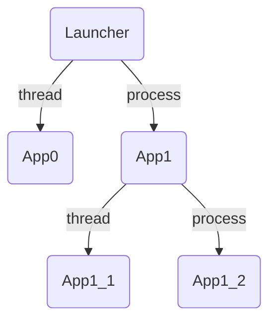

# チュートリアル
ここではJarvisEngineを使いこなすための簡単な機能の説明と、例を紹介します。

## プロジェクトの構造
`python -m JarvisEngine create -d MyProject`で作成したテンプレートプロジェクトの中身を覗いて見ましょう。プロジェクトの構造は次のようになっているはずです。
```
MyProject
├── app.py
└── config.json5
```
- app.py
```py
from JarvisEngine.apps import BaseApp

class App(BaseApp):

    def Start(self):
        self.logger.info("Started!")

    frame_rate = 10.0
    def Update(self, delta_time: float) -> None:
        self.logger.info(f"Updating in {delta_time:.2f} secs.")
```

- config.json5
```json
{
    MyApp: {
        path: "app.App",
        thread: true,
        apps:{}
    }
}
```

## ファイルの説明
テンプレートプロジェクトにはアプリケーションファイルと構造記述ファイルがあります。  
JarvisEngineを起動するためにはこれらのファイルが欠かせません。それでは一つずつ説明して行きましょう。

### アプリケーションファイル (`app.py`)
アプリケーションの実際の機能を記述する**pythonソースファイル**です。  
全てのアプリケーションはスレッドまたはプロセスで並列に動作します。  
いくつかのオーバーライド可能なメソッドを持つ`BaseApp`を必ず継承して動作します。

- Start(self)  
並列処理を開始した時に呼ばれるメソッドです。アプリケーションのメイン処理に必要なことはここで行います。

    ```py
    class App(BaseApp):

        def Start(self):
            ...
    ```

- frame_rate
`Update`メソッド呼ぶフレームレートです。frame_rateの値によって`Update`メソッドの呼ばれ方は異なります。
    - 正の時  
    そのフレームレートで`Update`メソッドは呼ばれます。
    - 0.0の時   
    一度のみ`Update`メソッドを呼びます。周期が無限大に発散するためです。
    - 負の時  
    直ちに次の`Update`メソッドを実行します。周期が負になり次のフレームが過去になるため待ち時間が常に0になるためです。  

    ```py
    class App(BaseApp):

        frame_rate = 1.0
        ...
    ```

- Update(self, delta_time)  
frame_rateの数だけ一秒間にUpdateが呼び出されます。引数の`delta_time`は前のフレームからの経過時間です。`delta_time`は最初のみ0.0に近い値をとることに注意してください。

    ```py
    class App(BaseApp):

        def Update(self, delta_time):
            ...
    ```

ここで紹介したメソッド以外にもいくつかオーバーライド可能なメソッドが存在します。
- Init(self)  
アプリケーションコンストラクタ内で最後に呼び出されます。

- RegisterProcessSharedValues(self, sync_manager)  
セクション [アプリケーション間で値を共有する](#アプリケーション間で値を共有する) にて説明します。
- RegisterThreadSharedValues(self)  
セクション [アプリケーション間で値を共有する](#アプリケーション間で値を共有する) にて説明します。
- Awake(self)  
プロセスまたはスレッドの開始直後に呼び出されます。ここでは後に紹介するプロセス/スレッド間で共有された値を使用できないことに注意してください。

- End(self)  
プロセス/スレッドの最後に呼び出されます。

- Terminate(self)  
プロセス/スレッドの終了直前に呼ばれます。子アプリケーションを持ちそれが終了しない場合、このメソッドは呼び出されないので注意してください。


### 構造記述ファイル (`config.json5`)
アプリケーションを起動構造を記述する**json5ファイル**です。任意の名前に対し、アプリケーションのモジュールパスを指定することで記述します。また、スレッドまたはプロセスのどちらで並列処理を開始するかも記述します。  
このファイルの最上位のフィールドや、`apps`以降に同じ形式で記述することにより複数のアプリケーションを起動することができます。詳しくはセクション[複数のアプリケーションを起動する](#複数のアプリケーションを起動する)にて説明します。

- 例  
```json5
{
    App0: {
        path: "App0.app.App0",
        thread: true,
        // `apps`　is not necessarry.
    },
    App1: {
        path: "App1.app.App1",
        thread: false,
        apps: {
            App1_1: {
                path: "App1.App1_1.app.App1_1",
                thread: true,
                apps: {}
            },
            App1_2: {
                path: "App1.App1_2.app.App1_2",
                thread: false,
            }
        }
    }
}
```
- `path`について  
起動するアプリケーションクラスまでのモジュールパスです。**pythonのimport文で読み込み可能な形式で**記述してください。
- `thread`について  
`true`の場合、そのアプリケーションはスレッド(`threading`モジュール)を用いて並列処理を行います。`false`の場合はプロセス(`multiprocessing`モジュール)を用いて別のインタプリタで実行されます。   
<br>

json5を使用している主な理由はコメントの追加と書きやすさのためです。起動時に明示的に指定すれば別の名前のJSONファイルでも読み込み可能です。


## 複数のアプリケーションを起動する
上記の[構造記述ファイル (`config.json5`)](#構造記述ファイル-(`config.json5`))
で記した例のアプリケーションの起動構造は、次のような木構造になります。



### プロセスとスレッド
プロセスで起動する場合とスレッドで起動する場合は明確な違いがあります。インタプリタが分離されメモリが完全に分けられるものが**プロセス**です。スレッドはそのプロセス内で行われ、メモリは共有されています。  
スレッドの場合はメモリが共有されリソースの受け渡しが非常に簡単かつ起動が早い一方、GILによるパフォーマンス面の制限があります。  
プロセスの場合はインタプリタが完全に分離されるため、GILによるパフォーマンスの制限は受けませんが、共有できるリソースに制限があります。

### SpawnとFork
プロセスを開始する方法には代表的に`spawn`と`fork`が存在します。(`fork`はUNIX系のみ)
デフォルトで`spawn`を使用するようにしています。  
後の[エンジン設定](エンジン設定)にてJarvisEngineのプロセスの`start_method`を変更する方法を解説します。  
#### **Note**  
`fork`を利用したマルチプロセススレッドは危険で、フリーズなどの予期せぬバグに出会う可能性があります！`fork`を使用する場合はアプリケーションの起動構成を慎重に設計してください。
## アプリケーション間で値を共有する
### プロセス間
### スレッド間

## オーバーライドメソッドについて
## エンジン設定

## JarvisEngineの起動コマンド


