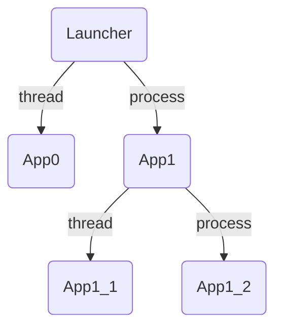

# チュートリアル
ここではJarvisEngineを使うための簡単な機能説明と、いくつかの例を紹介します。

## プロジェクトの構造
`python -m JarvisEngine create -d MyProject`で作成したテンプレートプロジェクトの中身を覗いて見ましょう。プロジェクトの構造は次のようになっているはずです。
```
MyProject
├── app.py
└── config.json5
```
- app.py
```py
from JarvisEngine.apps import BaseApp

class App(BaseApp):

    def Start(self):
        self.logger.info("Started!")

    frame_rate = 10.0
    def Update(self, delta_time: float) -> None:
        self.logger.info(f"Updating in {delta_time:.2f} secs.")
```

- config.json5
```json
{
    MyApp: {
        path: "app.App",
        thread: true,
        apps:{}
    }
}
```

## ファイルの説明
テンプレートプロジェクトにはアプリケーションファイルと構造記述ファイルがあります。  
JarvisEngineを起動するためにはこれらのファイルが欠かせません。それでは一つずつ説明して行きましょう。

### アプリケーションファイル (`app.py`)
アプリケーションの実際の機能を記述する**pythonソースファイル**です。  
全てのアプリケーションは**スレッド**または**プロセス**で並列に動作します。  
いくつかのオーバーライド可能なメソッドを持つ`BaseApp`を必ず継承して動作します。

- Start(self)  
並列処理を開始した時に呼ばれるメソッドです。アプリケーションのメイン処理に必要なことはここで行います。

    ```py
    class App(BaseApp):

        def Start(self):
            ...
    ```

- frame_rate   
`Update`メソッド呼ぶフレームレートです。frame_rateの値によって`Update`メソッドの呼ばれ方は異なります。
    - 正の時  
    そのフレームレートで`Update`メソッドは呼ばれます。
    - 0.0の時   
    一度のみ`Update`メソッドを呼びます。周期が無限大に発散するためです。
    - 負の時  
    直ちに次の`Update`メソッドを実行します。周期が負になり次のフレームが過去になり、待ち時間が常に0になるためです。  

    ```py
    class App(BaseApp):

        frame_rate = 1.0
        ...
    ```

- Update(self, delta_time)  
frame_rateの数だけ一秒間にUpdateが呼び出されます。引数の`delta_time`は前のフレームからの経過時間です。`delta_time`は最初のみ0.0に近い値(または0.0)をとることに注意してください。

    ```py
    class App(BaseApp):

        def Update(self, delta_time):
            ...
    ```

ここで紹介したメソッド以外にもいくつかオーバーライド可能なメソッドが存在します。
- Init(self)  
アプリケーションコンストラクタ内で最後に呼び出されます。

- RegisterProcessSharedValues(self, sync_manager)  
セクション [アプリケーション間で値を共有する](#アプリケーション間で値を共有する) にて説明します。
- RegisterThreadSharedValues(self)  
セクション [アプリケーション間で値を共有する](#アプリケーション間で値を共有する) にて説明します。
- Awake(self)  
プロセスまたはスレッドの開始直後に呼び出されます。ここでは後に紹介するプロセス/スレッド間で共有された値を使用できないことに注意してください。

- End(self)  
プロセス/スレッドの最後に呼び出されます。

- Terminate(self)  
プロセス/スレッドの終了直前に呼ばれます。子アプリケーションが終了しない場合、このメソッドは呼び出されないので注意してください。


### 構造記述ファイル (`config.json5`)
アプリケーションを起動構造を記述する**json5ファイル**です。任意の名前に対し、アプリケーションのモジュールパスを指定することで記述します。また、スレッドまたはプロセスのどちらで並列処理を開始するかも記述します。  
このファイルの最上位のフィールドや、`apps`以降に同じ形式で記述することにより複数のアプリケーションを起動することができます。起動について詳しくはセクション [複数のアプリケーションを起動する](#複数のアプリケーションを起動する) の中で説明します。

- 例  
```json5
{
    App0: {
        path: "App0.app.App0",
        thread: true,
        // `apps`　is not necessary.
    },
    App1: {
        path: "App1.app.App1",
        thread: false,
        apps: {
            App1_1: {
                path: "App1.App1_1.app.App1_1",
                thread: true,
                apps: {}
            },
            App1_2: {
                path: "App1.App1_2.app.App1_2",
                thread: false,
            }
        }
    }
}
```
- `path`について  
起動するアプリケーションクラスまでのモジュールパスです。**pythonのimport文で読み込み可能な形式で**記述してください。
- `thread`について  
`true`の場合、そのアプリケーションはスレッド(`threading`モジュール)を用いて並列処理を行います。`false`の場合はプロセス(`multiprocessing`モジュール)を用いて別のインタプリタで実行されます。   
<br>

json5を使用している主な理由はコメントの追加と書きやすさのためです。起動時に明示的に指定すれば、別の名前のJSONファイルでも読み込み可能です。詳しくはセクション [JarvisEngineの起動コマンド](#JarvisEngineの起動コマンド) で説明します。


## 複数のアプリケーションを起動する
上記の[構造記述ファイル (`config.json5`)](#構造記述ファイル-(`config.json5`))
で記した例のアプリケーションの起動構造は、次のような木構造になります。最上位には`Launcher`アプリケーションがあり、そこから木構造のようにアプリケーションが起動していきます。



### プロセスとスレッド
プロセスで起動する場合とスレッドで起動する場合は明確な違いがあります。インタプリタが分離されメモリが完全に分けられるものが**プロセス**です。スレッドはそのプロセス内で行われ、メモリは共有されています。  
スレッドの場合はメモリが共有されリソースの受け渡しが非常に簡単かつ起動が早い一方、GILによるパフォーマンス面の制限があります。  
プロセスの場合はインタプリタが完全に分離されるため、GILによるパフォーマンスの制限は受けませんが、共有できるリソースに制限があります。

### SpawnとFork
プロセスを開始する方法には代表的に`spawn`と`fork`が存在します。(`fork`はUNIX系のみ)  
JarvisEngineではデフォルトで`spawn`を使用するようにしています。  
後の[エンジン設定](エンジン設定)にてJarvisEngineのプロセスの`start_method`を変更する方法を解説します。  
#### **Note**  
`fork`を利用したマルチプロセススレッドは危険で、フリーズなどの予期せぬバグに出会う可能性があります！`fork`を使用する場合はアプリケーションの起動構成を慎重に設計してください。
## アプリケーション間で値を共有する
アプリケーション間で値を共有しながら処理を行うことは並列処理には必須です。しかし並列処理を構築する際に出会うタチの悪いバグはよくそこで発生します。  
JarvisEngineでは、スレッドやプロセスの間で共有する値を**明示的に**登録し、一つのオブジェクトで管理しています。

### 基本概念
共有する時の基本的な概念は**ファイルシステム**を参考にし、そこに使われる*パス*はpythonのモジュールシステムと一致させています。次のようにアプリケーションが構成されているとしましょう。これを例に説明していきます。  

### FolderDict (with Lock)
全ての共有されたオブジェクトは`FolderDict_withLock`というクラスによって管理されます。[FolderDictの詳細仕様はFolderDictのリポジトリをご覧ください。](https://github.com/Geson-anko/folder_dict)  
*パス*によってオブジェクトを登録することができます。JarvisEngineでセパレータは常にドット`.`です。変更することはできません。
- Example
```py
fd = FolderDict(sep=".")
fd["path.to.object"] = "instance"
> fd["path.to"]["object"]
--> "instance"
```
### パスとオブジェクトの共有
パスはドット`.`区切りの形式であり、パス文字列の先頭にドットがない**絶対パス**と、先頭にいくつかのドットを持ち相対的に参照する**相対パス**の２つの形式が存在します。  
絶対パスはどのアプリケーションにおいても同様に使用することができますが、アプリケーションの起動構成を変更した場合は記述したパスも変更しなければなりません。また相対パスはそのアプリケーションの起動構成上の位置を基準にするため、いくつかのアプリケーションをまとめた**コンポーネント**にして、他のJarvisEngineプロジェクトに簡単に移植することができます。  

Note: 相対パスは、**パス文字列の先頭のドット数 - 1**個階層をさかのぼり、参照します。

Note: 絶対パスは必ず先頭に`Launcher`が付きます。これは起動構成ファイルの中で最上位のアプリケーションが、`JarvisEngine.apps.Launcher`によって起動されるためです。


- Example  
    `App1`が`int_value`という名前で値をプロセス間で共有する場合を考えます。
    次のようにすることで共有できます。
    
    ```py
    import multiprocessing as mp
    class App1(BaseApp):
    
        def RegisterProcessSharedValues(self, sync_manager):
            super().RegisterProcessSharedValues(sync_manager) # must call.
            self.addProcessSharedValues("int_value",mp.Value("i"))
    ```

    そうすると`FolderDict` の中では、`Launcher.App1.int_value`という名前で管理されます。このように全てのアプリケーションでは起動構成上の位置を基準にオブジェクトを登録します。

    自分自身で共有した`int_value`にアクセスする際には`<BaseApp>.getProcessSharedValues(name)`というメソッドを使用します。もちろん絶対パスと相対パスどちらでもアクセスできます。  
    また、`App0`が`bool_value`という名前で値を共有していたとしても、絶対的に、または相対的にアクセスすることができます。

    ```py
    ... # in App1 class.
        def Start(self):
            # Absolute 
            int_value = self.getProcessSharedValue("Launcher.App1.int_value")
            bool_value = self.getProcessSharedvalue("Launcher.App0.bool_value")

            # Relative
            int_value = self.getProcessSharedValue(".int_value")
            bool_value = self.getProcessSharedValue("..App0.bool_value")
    ...
    ```

### プロセス間

- 登録する  
マルチプロセス間で値を共有する場合は、BaseAppの`RegisterProcessSharedValues`メソッドをオーバーライドし、内部で`addProcessSharedValue`メソッドを用いて登録してください。  
Note: superクラスの`RegisterProcessSharedValues`を必ず呼び出してください。  
Note: 引数の`sync_manager`は`multiprocessing.Manager`の返り値です。

```py
import multiprocessing as mp
class App(BaseApp):
    def RegisterProcessSharedValues(self, sync_manager):
        super().RegisterProcessSharedValues(sync_manager)
        v = mp.Queue()
        self.addProcessSharedValue("queue",v)
```

- 参照する  
`getProcessSharedValue`を用いて参照します。
```py
... # in App class
    def Start(self):
        v = self.getProcessSharedValue("Launcher.path.to.queue")
...
```

Note: `process_shared_values`属性から、プロセス間で共有されている全てのオブジェクトを管理している、`FolderDict`クラスにアクセスすることができます。  

Note: プロセス間でも状態が同期されるオブジェクトは`multiprocessing`モジュールなどから提供される特殊なもののみです。スレッド間で使用するメモリが共有されていることが前提のものは、共有したとしても同期されません。


### スレッド間
- 登録する    
マルチスレッド間で値を共有する場合は、BaseAppの`RegisterThreadSharedValues`メソッドをオーバーライドし、内部で`addThreadSharedValue`メソッドを用いて登録してください。   

```py
class App(BaseApp):
    def RegisterThreadSharedValues(self):
        super().RegisterThreadSharedValues(sync_manager)
        v = {"age": 19}
        self.addThreadSharedValue("personal_data",v)
```
Note: superクラスの`RegisterThreadSharedValues`を必ず呼び出してください。  
Note: `addThreadSharedValues`はのちに[オーバーライドメソッド](#オーバーライドメソッドについて)で説明する、`Start`メソッドや`Update`メソッド内でも呼び出すことが可能です。


- 参照する  
`getThreadSharedValue`を用いて参照します。
```py
... # in App class
    def Start(self):
        v = self.getThreadSharedValue("Launcher.path.to.queue")
...
```
Note: `thread_shared_values`属性から、プロセス間で共有されている全てのオブジェクトを管理している、`FolderDict`クラスにアクセスすることができます。      
Note: スレッド間ではメモリが共有されているため、どんなオブジェクトでも共有可能です。  
Note: 起動構成の中で同一のプロセス内のみで共有されます。

## エンジン設定
いくつかのカスタム可能な設定項目が存在します。全ての設定可能項目とそのデフォルト値は`JarvisEngine/default_engine_config.toml`に記述されます。
オーバーライドしたい項目を記述し、起動時にそのファイルを指定することで任意の設定を変えられます。
```sh
python -m JarvisEngine run -ec engine_config.toml
```
### logging
`[logging]`テーブルに記述されます。
- host  
`LoggingServer`を立てるホストです。`Logger`もここにログを送信します。

- port  
`LoggingServer`を立てるポートです。`Logger`もここにログを送信します。

- message_format  
ログを出力する時のメッセージフォーマットです。公式のロギングフォーマットに従います。

- date_format  
ログメッセージの中で時刻を表示する際のフォーマットです。

### multiprocessing
`[multiprocessing]`テーブルに記述されます。
- start_method  
マルチプロセスを開始する方法です。デフォルト値は`spawn`です。

## JarvisEngineの起動コマンド
プロジェクトを作成する`create`コマンドと起動する`run`コマンドがあります。

```sh
python -m JarvisEngine command --args
```

### 常に存在する引数
- `-ll`, `--log_level`  
ログの出力レベルです。デフォルトは`DEBUG`です。  
`DEBUG`,`INFO`,`WARNING`,`ERROR`,`CRITICAL`のどれかを指定してください。
### create
JarvisEngineで起動可能なテンプレートプロジェクトを生成します。
```sh
python -m JarvisEngine create --args
```

引数

- `-d`, `--creating_dir`  
プロジェクトを作成するディレクトリです。デフォルトは`./`です。  
名前をここに与えることでプロジェクト名となります。

### run
JarvisEngineプロジェクトを起動します。
```sh
python -m JarvisEngine run --args
```

引数

- `-d`, `--project_dir`    
プロジェクトディレクトリです。デフォルト値は`./`です。  

- `-c`, `--config_file`  
アプリケーションの起動構成を記述したファイルのパスです。デフォルトは`config.json5`です。  

- `-ec`, `--engine_config_file`  
エンジンの設定を記述したファイルです。デフォルトは`JarvisEngine/default_engine_config.toml`が指定されています。


